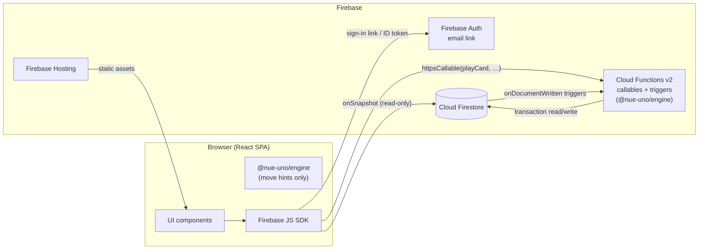
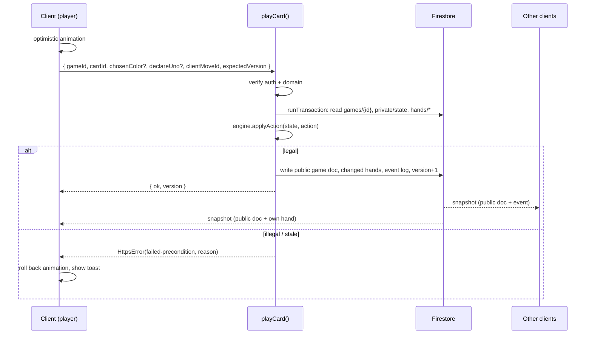

# Architecture

Related: [PRD](../PRD.md) · [Data model](data-model.md) · [API](api.md) · [Game engine](game-engine.md)

## 1. Overview

Nue Uno is a single-page React app on Firebase Hosting. It reads game state from Cloud Firestore through real-time listeners and changes state **only** through Cloud Functions callables. The functions run a shared, pure TypeScript game engine inside Firestore transactions. That makes the server the single source of truth, and it keeps hidden information (the deck and other players' hands) off every client.



### Request lifecycle for a move



## 2. Tech stack

| Layer | Choice | Why |
|---|---|---|
| Language | TypeScript (strict) across the board | One language, and the engine is shared between client and server |
| Monorepo | npm workspaces: `apps/web`, `functions`, `packages/engine` | Simple, no extra tooling |
| Frontend | React 18+, Vite, React Router, Tailwind CSS, Framer Motion (card animations), Zustand (local UI state) | Fast to build, small bundle, good animation support |
| Hosting | Firebase Hosting (SPA rewrite to `index.html`) | Required, with free SSL, CDN, and preview channels |
| Auth | Firebase Auth, **Email link** provider | Required, and passwordless |
| Database | Cloud Firestore (Native mode), in the same region as the functions | Real-time listeners, transactions, security rules |
| Server | Cloud Functions for Firebase **2nd gen**, Node 22, `onCall` + Firestore triggers + one scheduled job | Server-authoritative game logic with no server to manage |
| Validation | `zod` schemas shared by the web app and functions | One definition of every request payload |
| Testing | Vitest, `@firebase/rules-unit-testing`, Firebase Emulator Suite, Playwright | See [testing-and-deployment.md](testing-and-deployment.md) |
| CI/CD | GitHub Actions | The code lives in GitHub |

**Region:** `us-central1` for functions, and Firestore location `nam5` (US multi-region) or `us-central1`. Firestore's location can't be changed later, so we pick it once and document it in `firebase.json`.

## 3. Key decisions

### ADR-1: Server-authoritative moves (no client writes to game state)
- **Context:** Ranked results seed the bracket, so cheating must be impossible. If clients wrote game documents themselves, any player could read the deck or change their hand from the browser console.
- **Decision:** Clients have **no write access** to game collections. Every state change goes through a callable function, which validates auth, loads state in a transaction, runs `engine.applyAction`, and writes the result.
- **Hidden information:**
  - Draw pile, RNG seed, and move-dedupe log live in `games/{id}/private/state`. Security rules make it unreadable by any client.
  - Each hand lives in `games/{id}/hands/{uid}`, readable only by that player.
  - The public doc `games/{id}` has only what everyone can see: top card, current color, hand **counts**, turn, and deadline.
- **Consequence:** Every move costs one function call, about 150–400ms end to end when the function is warm. That's fine for a turn-based game. Cold starts are handled by setting `minInstances: 1` on the move functions during the event (see §6).

### ADR-2: Shared pure engine package
`packages/engine` has no Firebase or I/O dependencies. It exports types plus `createGame`, `applyAction`, `legalActions`, and `rankPlayers`. Functions use it to decide moves. The client uses it only to highlight playable cards and disable illegal buttons, never as the authority. The engine takes a seeded RNG, so any game can be replayed from its seed and action log. See [game-engine.md](game-engine.md).

### ADR-3: Email-link auth, restricted to the company domain
Firebase Auth can't stop someone from requesting a sign-in link for any email address. So the domain is enforced at every layer that matters:

1. **UI:** reject emails that don't end in `@nuesynergy.com` before calling `sendSignInLinkToEmail`.
2. **Firestore rules:** every read requires `request.auth.token.email_verified == true && request.auth.token.email.matches('.*@nuesynergy[.]com$')`. Signing in by email link sets `email_verified` automatically.
3. **Functions:** a shared `requireEmployee(request)` guard applies the same check and throws `permission-denied` otherwise.
4. **Optional hardening:** upgrade to Firebase Auth with Identity Platform and add a `beforeUserCreated` blocking function that rejects other domains when the account is created. We'll decide in Week 1. Layers 1–3 are enough on their own.

**Flow:**
- `sendSignInLinkToEmail(email, { url: <origin>/auth/finish, handleCodeInApp: true })`, then save the email in `localStorage`.
- On `/auth/finish`, check `isSignInWithEmailLink`, read the saved email (or ask for it if the link was opened on a different device), and call `signInWithEmailLink`.
- Use `browserLocalPersistence` so players stay signed in.
- Enable **email enumeration protection** in the Auth settings.
- **Admins** are identified by a custom claim `admin: true`, set by `scripts/grant-admin.ts` with a service account. Security rules and functions check `request.auth.token.admin`.

**Risk:** M365 may quarantine the sign-in emails or rewrite their links (Safe Links). The plan is to customize the email template and sender name, test with IT in Week 1, and get the sender and `*.firebaseapp.com` / `*.web.app` links allowlisted. If links still fail, the fallback is adding the Microsoft OIDC provider. The app's auth screen can take a second provider without other changes.

### ADR-4: Server-enforced turn timer without a scheduler
- Each state change sets `turnDeadline = now + 30s` (or `+5s` if the player is marked Away) on the public doc.
- Every client shows a countdown. When it reaches zero plus 1 second of grace, **any** seated player's or spectator's client calls `claimTimeout({ gameId, expectedVersion })`.
- The function checks `now >= turnDeadline` inside the transaction, then applies the engine's `timeout` action. Duplicate calls are harmless because the version check rejects them.
- This needs no Cloud Tasks and no per-second polling. If every client disconnects, the game simply pauses, which is the right behavior.
- A daily scheduled function, `cleanupStaleGames`, abandons lobbies idle for more than 30 minutes and in-progress games idle for more than 2 hours.

### ADR-5: Derived data via triggers
When a game finishes, the move function writes `results/{gameId}` in the same transaction. The trigger `onResultWritten` then recomputes that player's `leaderboard` entry (best 10 of their results) and, if the game belongs to a bracket match, advances the bracket. Keeping these out of the move transaction makes moves fast and lets an admin void a result and have everything recompute.

## 4. Frontend structure

```
apps/web/src/
  main.tsx, App.tsx, router.tsx
  firebase.ts                # init app, auth, firestore, functions; emulator wiring in dev
  auth/                      # SignIn, FinishSignIn, RequireAuth, useCurrentUser
  features/
    lobby/                   # LobbyPage, TableCard, CreateTableDialog, QuickMatchButton
    table/                   # PreGameTable (seats, ranked toggle, start)
    game/                    # GamePage, Hand, Card, DiscardPile, OpponentSeat, TurnTimer,
                             # ColorPicker, UnoButton, CatchButton, ResultsDialog
    leaderboard/             # LeaderboardPage, MyQualifierCard
    profile/                 # ProfilePage (name, avatar, attending toggle, history)
    bracket/                 # BracketPage, MyMatchBanner
    tv/                      # TvPage (big-screen bracket + live tables)
    admin/                   # AdminHome, PlayersTable, SeasonSettings, BracketBuilder, Overrides
  hooks/                     # useGame(gameId), useMyHand(gameId), useLeaderboard(), useBracket()
  api/                       # typed wrappers around httpsCallable, using shared zod schemas
  ui/                        # design-system primitives (Button, Dialog, Toast, Avatar)
```

**Routes:** `/signin`, `/auth/finish`, `/` (lobby), `/t/:gameId` (pre-game table or game), `/leaderboard`, `/profile`, `/bracket`, `/tv`, `/admin/*` (guarded by the admin claim).

**State:** Firestore listeners are the source of truth for server state. Zustand holds only local UI state: the selected card, open dialogs, and pending optimistic moves.

**Card rendering:** cards are SVG components with original art. Each color pairs with a shape (red ◆, yellow ●, green ▲, blue ■) so the cards are colorblind-safe (PRD G9).

## 5. Security model summary

| Resource | Client read | Client write |
|---|---|---|
| `users/{uid}` | any employee | none (profile updates go through `saveProfile`) |
| `seasons/*`, `leaderboard/**`, `results/*`, `brackets/**` | any employee | none |
| `games/{id}` (public) | any employee | none |
| `games/{id}/hands/{uid}` | only `uid` | none |
| `games/{id}/private/*` | **none** | none |
| `games/{id}/events/*` | any employee | none |
| `auditLog/*` | admins | none |

The full rules are in [data-model.md](data-model.md#security-rules).

## 6. Operations

- **Environments:** `nue-uno-dev` and `nue-uno-prod`, two separate Firebase projects, both on the **Blaze** plan (functions require it).
- **Cost:** about 50 users generate a few hundred thousand Firestore operations and function calls in total, well within the free tier. Set a **$25 budget alert** anyway.
- **Event-day warmup:** set `minInstances: 1` on `playCard`, `drawCard`, `passTurn`, `claimTimeout`, and `callUno` through a config flag. Deploy it the day before and turn it off afterwards.
- **Observability:** Cloud Logging with structured logs (`gameId`, `uid`, `action`, `version`, `durationMs`). Firebase console alerts for function error rate.
- **Backups:** export Firestore to a GCS bucket right before seeding lock and before the event.
