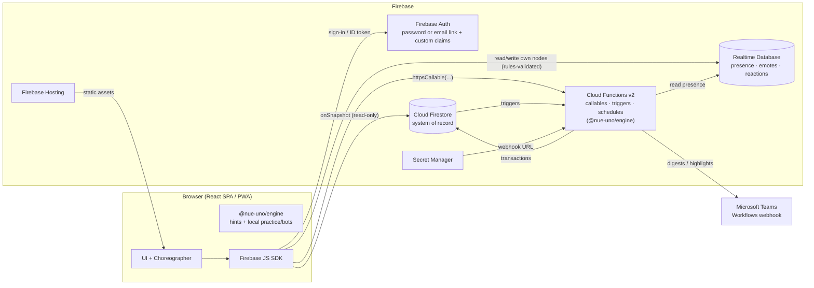

# Architecture

Related: [PRD v2](../PRD.md) · [Experience & Motion](../design/experience-and-motion.md) · [Data model](data-model.md) · [API](api.md) · [Game engine](game-engine.md)

## 1. Overview

Nue Uno is a single-page React app (and installable PWA) on Firebase Hosting. It uses two databases:

- **Cloud Firestore** is the system of record: games, results, leaderboards, brackets, Passport, and Pick'em. Clients **only read** it. Every change goes through Cloud Functions callables. The callables run a shared, pure TypeScript game engine inside Firestore transactions, so the server is the only authority and hidden information (the deck and other players' hands) never reaches a client.
- **Realtime Database (RTDB)** holds **short-lived social data**: presence (who's online), emotes, and crowd reactions. Clients write their own entries directly, and security rules validate them and limit how fast they can write. Nothing competitive lives in RTDB.

Practice and tutorial games against bots run **entirely in the browser** using the same engine. Nothing is at stake in them, so they don't need the server.



### Request lifecycle for a move

```mermaid
sequenceDiagram
  participant C as Client (player)
  participant F as playCard()
  participant D as Firestore
  participant O as Other clients + TV

  C->>C: optimistic throw animation (X3)
  C->>F: { gameId, cardId, chosenColor?, declareUno?, clientMoveId, expectedVersion }
  F->>F: requirePlayer (domain + active claim)
  F->>D: runTransaction: read game, private/state, hands/*
  F->>F: paused? → reject · now ≥ finalLapAt? → engine startFinalLap first
  F->>F: engine.applyAction(state, action)
  alt legal
    F->>D: write public doc, changed hands, private, events; deadline = now + turnMs + 1.5s grace
    F-->>C: { ok, version }
    D-->>O: snapshot → EventQueue → Choreographer animates
    D-->>C: snapshot → reconcile optimistic move
  else illegal / stale / paused
    F-->>C: HttpsError(failed-precondition, reason)
    C->>C: spring card back + hint toast
  end
```

## 2. Tech stack

| Layer | Choice | Why |
|---|---|---|
| Language | TypeScript (strict) everywhere | One language, and the engine is shared |
| Monorepo | npm workspaces: `apps/web`, `functions`, `packages/engine`, `packages/shared` (zod schemas, constants) | Simple |
| Frontend | React 18+, Vite, React Router, Tailwind CSS, Zustand (UI state) | Fast to build, small bundle |
| Motion & effects | **Framer Motion** (springs, layout and FLIP animation, drag), **canvas-confetti** (particles, runs in a worker), **Web Audio** (synthesized sounds, no sprite file), CSS 3D for card flips | Covers the whole [motion spec](../design/experience-and-motion.md) without a 3D engine. Loaded only when a game opens. |
| PWA | `vite-plugin-pwa` (manifest, icons, caching of the app shell and static assets) | Installable, full-screen, fast to reopen |
| Hosting | Firebase Hosting (SPA rewrite) | Required |
| Auth | Firebase Auth email + password (default) or email link, plus **custom claims** (`admin`, `active`) | Required. Claims make permission checks in rules cheap. |
| Database | Cloud Firestore (Native, `nam5`) + **Realtime Database** (`us-central1`) | Firestore for durable data, RTDB for presence and short-lived social data |
| Server | Cloud Functions for Firebase 2nd gen, Node 22 | Callables, Firestore triggers, `onSchedule` jobs |
| Secrets | Secret Manager via `defineSecret` | Teams webhook URL |
| Validation | zod in `packages/shared` | One definition of every request payload |
| Testing | Vitest, fast-check, `@firebase/rules-unit-testing` (Firestore + RTDB), Emulator Suite, Playwright | See [testing-and-deployment.md](testing-and-deployment.md) |
| CI/CD | GitHub Actions | The code lives in GitHub |

## 3. Key decisions

### ADR-1: Moves are validated by the server (clients never write game state)
- Clients have **no write access** to any Firestore collection. Every change goes through a callable that checks permissions, loads the game in a transaction, runs `engine.applyAction`, and writes the result.
- **Hidden information:** the draw pile, RNG seed, move-dedupe log, and per-game stats live in `games/{id}/private/state`, which rules make unreadable. Each hand lives in `games/{id}/hands/{uid}`, readable only by its owner. The public game doc contains only what everyone can see.
- **Consequence:** one function call per move, about 150–400ms when the function is warm. The optimistic throw animation (X3) hides this delay. Cold starts are avoided with `minInstances: 1` on the move functions during Uno Hours and on event day.

### ADR-2: One shared, pure engine package
`packages/engine` has no I/O, no clock, and no `Math.random`. It exports types plus `createGame`, `applyAction`, `legalActions`, `rankPlayers`, and `botAction`. Functions use it as the authority. The client uses it for hints, and it runs practice and tutorial games locally. The RNG is seeded, so every game can be replayed. See [game-engine.md](game-engine.md).

### ADR-3: Password or email-link auth, company domain, and roster approval
1. The **UI** rejects non-`@nuesynergy.com` emails before creating an account, signing in with a password, or calling `sendSignInLinkToEmail`.
2. The **custom claim `active: true`** is required for every read of player data (Firestore and RTDB rules) and by every player callable. `saveProfile` sets it when the email is on the imported **roster**, or right away if `config/app.rosterRequired == false`. Otherwise the user stays *pending* until an admin runs `approveUser`. After the claim changes, the client refreshes its ID token with `getIdToken(true)`.
3. **Rules and functions** also check the domain pattern (`requireEmployee`, `signedInEmployee()`, and the RTDB rules), as a second layer of defense. They do **not** require `email_verified` (see the 2026-09-25 revision below).
4. **Admins** have the claim `admin: true`, set by `scripts/grant-admin.ts`.
5. Optional: upgrade to Identity Platform and add a `beforeUserCreated` blocking function. Decide in Week 1.

**Flow:** `sendSignInLinkToEmail(email, { url: <origin>/auth/finish, handleCodeInApp: true })` → `/auth/finish` → `signInWithEmailLink` (ask for the email again if the link was opened on another device). Persistence is `browserLocalPersistence`, and email enumeration protection is turned on.

**Risk:** M365 quarantine or Safe Links may break the emails. Test with IT in Week 1. The fallback is the Microsoft OIDC provider.

**Revision (2026-09-25): passwords, no email verification.** Sign-in emails from `noreply@nue-uno-*.firebaseapp.com` weren't reaching company inboxes. The product owner chose **email + password** as the default sign-in, with the email link kept as an option.
- **What changed:**
  - The sign-in page defaults to Sign in / Create account with a password (8+ characters).
  - "Forgot password?" sends a reset email.
  - The profile page has a **Password** panel so existing email-link accounts can set one.
  - `email_verified` is no longer required by `requireEmployee`, the Firestore rules or the RTDB rules. The domain check stays everywhere.
- **Accepted risk:** without verification, anyone can create an account under any `@nuesynergy.com` address, including a coworker's that hasn't been claimed yet, and play under that name. The owner accepted this for an internal game.
- **Mitigations:**
  - The real owner can't be locked out silently: "Create account" fails with "already has an account", and they can use "Forgot password?" to take the account back, since the reset email goes to the real inbox.
  - An admin can disable a bad account in **Mission Control → Players**. That's `adminUpdateUser`: it blocks sign-in, removes the claim and revokes tokens, and needs a reason, which goes to `auditLog`. The Players list flags accounts that aren't on the HR roster.
  - Turning on `config/app.rosterRequired` limits activation to HR roster emails. That still allows impersonation of someone on the roster.
- **To tighten later:** Microsoft sign-in (Entra ID) proves inbox ownership without email. Or require `email_verified` again once mail delivery is fixed.

### ADR-4: The server owns the clock (turn timer, grace, Final Lap, pause)
All time decisions are made in functions, and the engine never reads a clock:

- **Turn deadline** = `now + turnMs(mode) + 1500ms grace`. `turnMs` is 30s in casual and ranked games, 20s in bracket games, and 5s for Away players. The client starts its visible countdown when its animation queue is empty ([motion spec §4](../design/experience-and-motion.md#4-the-event-to-animation-pipeline)).
- **Timeout:** when the countdown ends (plus 1s), any viewer's client calls `claimTimeout`. The function checks `now >= turnDeadline`, and the `expectedVersion` check makes duplicate calls harmless. No scheduler is needed.
- **Final Lap:** `finalLapAt = startedAt + cap` (20 minutes in qualifiers, 12 in the bracket) is stored on the public doc. **Before** applying any move or timeout, the function checks `now >= finalLapAt` and, if so, first applies the engine's `startFinalLap` action. Because turn deadlines guarantee some call arrives within about 32 seconds, the Final Lap always starts on time without a timer job.
- **Pause:** `pauseAll` sets `paused = true` and `pausedAt` on every in-progress bracket game. While paused, moves and timeouts are rejected with `PAUSED`. `resumeAll` shifts `turnDeadline` and `finalLapAt` forward by the length of the pause.
- **Cleanup:** the daily job `cleanupStaleGames` handles abandoned lobbies and games.

### ADR-5: Derived data is computed in triggers
The move transaction writes only the game itself plus `results/{gameId}` when the game ends. Everything else is recomputed by triggers:

| Trigger | Updates |
|---|---|
| `onResultWritten` | The leaderboard entry for each player (qualifier games only), the Passport, player stats, and bracket advancement |
| `onLeaderboardEntryWritten` | The Department Cup entry for that player's department |
| `onMatchCompleted` | Pick'em scores, TV ticker highlight, Teams post |

Triggers **recompute from the source data instead of adding increments**, so running one twice, voiding a result, or an admin override all stay correct.

### ADR-6: Realtime Database for presence and short-lived social data
- **Presence:** the standard Firebase pattern. Each client writes `/status/{uid}` = `{ state: 'online', activity, gameId?, at }` and registers `onDisconnect().set({ state: 'offline', at })`. The lobby's "Online now" list and Mission Control's disconnect alerts read it. Functions read it too, for "table forming" nudges.
- **Emotes and reactions:** clients write their *latest* emote or reaction to their own node (`/emotes/{gameId}/{uid}`, `/reactions/{targetId}/{uid}`). Rules enforce the allowed emoji list, domain, `active`, and a **minimum gap between writes** (`newData.at > data.at + 3000` for emotes and `+ 1000` for reactions). Viewers listen for `child_changed` events and animate them. The TV adds them up for the hype meter.
- **Why RTDB:** it has cheap, fast writes and a built-in disconnect hook, and keeps this traffic out of Firestore listeners and function calls.
- Emotes are shown only if the sender is seated at that game. The client filters them, and there's nothing competitive at stake.

### ADR-7: Practice and tutorial games run in the browser
`/practice` and `/tutorial` run `createGame` and `applyAction` locally, with `botAction` playing the bots after a delay of 0.9–1.8s. Nothing is written except one call to `completeTutorial` for the Passport stamp. **Bots never appear in Firestore games**, so ranked play stays human-only by design. The same bots drive the load test and the Mission Control demo mode.

### ADR-8: Notifications without push (MVP)
- **In-app inbox:** functions write `inbox/{uid}/items/{id}` for things like "table ready", "You're in! Seed 7", "Table forming — join", and rematch invites. The client listens to it and shows the right toast or full-screen takeover (N3). Web push is P2.
- **Teams:** functions post Adaptive Cards to a Teams **Workflows webhook**. The URL is stored in Secret Manager. Posts come from a daily 09:00 digest (`onSchedule`), the Uno Hour start (`onSchedule` per the season's Uno Hours), new #1 and match results (triggers). Each post type can be turned on or off in `config/app.teams`.

### ADR-9: TV as a separate route, directed by the admin
`/tv` is a full-screen, no-interaction route that listens to `tv/state` (scene, featured table, Selection Show step, auto-cycle). The admin's director callables (`setTvScene`, `advanceSelectionShow`) write that doc. The TV loads its own asset bundle (the bigger TV sound set and fireworks) and runs its own animation queue per table.

## 4. Frontend structure

```
apps/web/src/
  main.tsx, App.tsx, router.tsx, firebase.ts (Firestore, RTDB, Functions; emulator wiring)
  auth/            SignIn, FinishSignIn, PendingApproval, RequireAuth/RequireActive/RequireAdmin
  features/
    onboarding/    FirstRun (name, avatar, department, attending), RulesSheet, Tutorial
    lobby/         LobbyPage, OnlineNow, UnoHourCountdown, TableCard, QuickMatch, FormingToast
    table/         PreGameTable (seats, ranked toggle, collusion warning, QR share)
    game/          GamePage, Table, Hand, Card, Pile, OpponentSeat, TurnRing, ColorPicker,
                   UnoButton, CatchButton, EmoteBar, EventFeed, ResultsPodium, FinalLapBanner
    practice/      PracticeSetup, LocalGameRunner (engine + bots)
    leaderboard/   LeaderboardPage, MyQualifierCard, DepartmentCup
    passport/      PassportPage, StampGrid
    event/         EventHub, MyMatchCard, CheckIn (/table/:n), PickemPage, SpectateTable, ReactionBar
    tv/            TvRoot + scenes/{BracketBoard, PlayerIntros, SelectionShow, PickemStandings,
                   DeptCup, FeaturedTable, Awards, Champion}, Ticker, ReactionLayer
    admin/         MissionControl, Players, Roster, SeasonSettings, BracketBuilder, TvDirector,
                   Broadcast, Overrides, Stats, PrintBracket
    wrapped/       WrappedStory, ShareCard (html-to-image → PNG), HallOfFame
    dev/           EffectsGallery (/dev/effects, dev builds only)
  motion/          tokens.ts, EventQueue.ts, Choreographer.tsx, effects/* (one file per moment), fpsGovernor.ts
  audio/           sound.ts (Web Audio synth, unlock, per-device toggle), cues.ts, haptics.ts
  hooks/           useGame, useMyHand, useEvents, usePresence, useInbox, useLeaderboard, useBracket, useTvState
  api/             typed callable wrappers (zod from packages/shared)
  ui/              design-system primitives
```

**Routes:** `/signin`, `/auth/finish`, `/welcome`, `/` (lobby, or Event Hub when the season is in `event`), `/t/:gameId`, `/practice`, `/tutorial`, `/rules`, `/leaderboard`, `/passport`, `/profile`, `/bracket`, `/pickem`, `/table/:n` (QR check-in), `/watch/:gameId`, `/tv`, `/wrapped`, `/hall-of-fame`, `/admin/*`, `/dev/effects`.

**Code splitting:** first load (sign-in) ≤ 150 KB gzipped; lobby total ≤ 325 KB gzipped. Firestore is loaded only after sign-in. `game`, `tv`, `admin`, `wrapped`, and the motion and audio modules are lazy-loaded chunks.

**Card rendering:** SVG card faces from a single sprite sheet, with colorblind-safe shapes (red ◆, yellow ●, green ▲, blue ■) and the Nue Wild art.

## 5. Security model summary

`player` means company domain + claim `active == true` (`email_verified` is not required; ADR-3 revision).

| Resource | Client read | Client write |
|---|---|---|
| `config/*`, `users/{uid}` (own) | any signed-in company user (pending users need their own doc) | none |
| `users/*`, `seasons/*`, `leaderboard/**`, `departmentCup/**`, `results/*`, `brackets/**`, `passport/*`, `playerStats/*`, `picks/*`, `pickem/**`, `announcements/*`, `tv/*`, `awards/*`, `hallOfFame/*`, `wrapped/*` | player | none |
| `games/{id}`, `games/{id}/events/*` | player | none |
| `games/{id}/hands/{uid}` | only `uid` | none |
| `games/{id}/private/*` | **none** | none |
| `inbox/{uid}/items/*` | only `uid` | none |
| `roster/*`, `auditLog/*` | admin | none |
| RTDB `/status/{uid}` | player | own node, schema-validated |
| RTDB `/emotes/{gameId}/{uid}`, `/reactions/{targetId}/{uid}` | player | own node, allowed values only, rate-limited |

Full rules are in [data-model.md](data-model.md#security-rules).

## 6. Operations

- **Environments:** `nue-uno-dev` and `nue-uno-prod`, both on Blaze. Each has Firestore, RTDB, Functions, Hosting, and Secret Manager.
- **Cost:** well within the free tier at this scale. The biggest line item is `minInstances` during Uno Hours and the event, about a few dollars. Budget alert at $25.
- **Warm instances:** `WARM_MOVE_FUNCTIONS` config toggles `minInstances: 1` on the move callables. Turn it on for the qualifier weeks from 11:30 to 17:00 by redeploying, or leave it on (about $5–10/month). Keep it on for event day.
- **Observability:** structured logs (`gameId`, `uid`, `action`, `version`, `durationMs`). An alert when the function error rate is over 2%. The Mission Control stuck-table alerts (AD5) act as a human-facing monitor.
- **Backups:** export Firestore before seeding lock and on event morning.
