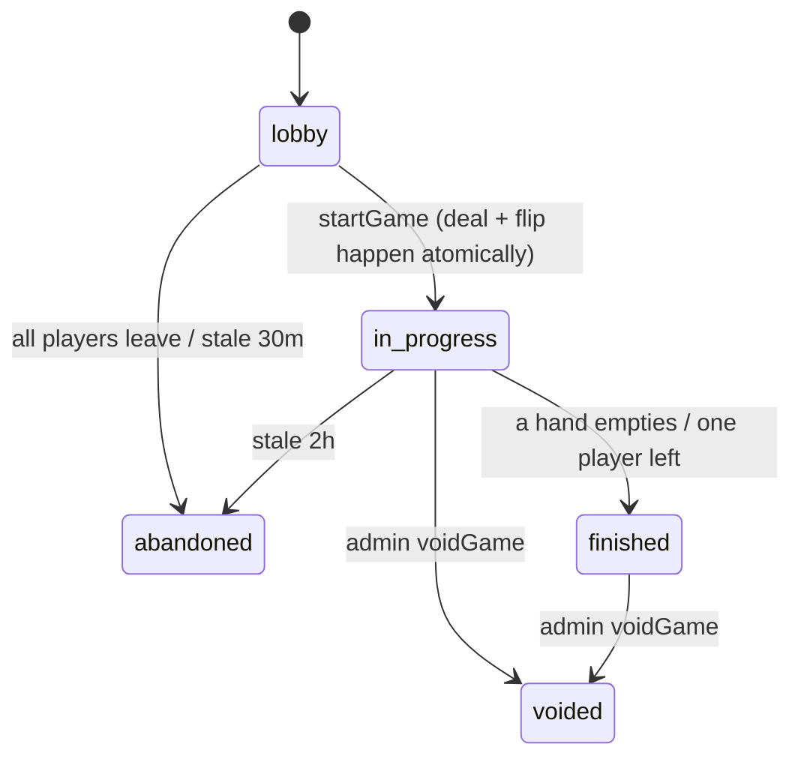
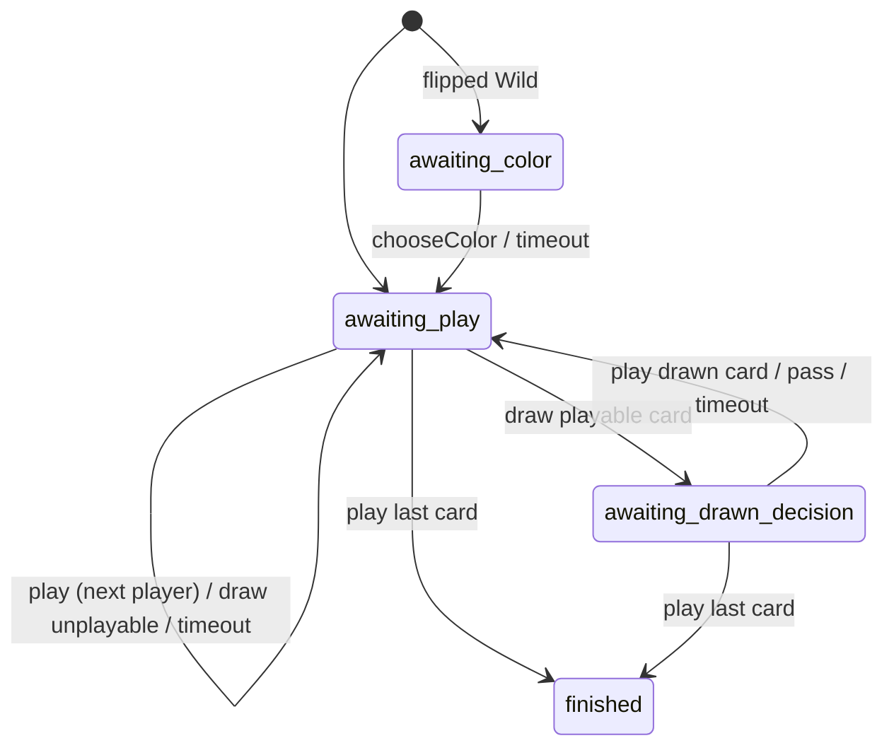

# Game Engine (`packages/engine`)

Related: [Architecture ADR-2](architecture.md#adr-2-shared-pure-engine-package) · [Data model](data-model.md) · [API](api.md)

The engine is a **pure, deterministic** TypeScript module. It does no I/O and uses no `Date.now()` or `Math.random()`. Time and randomness are passed in as inputs. Functions use it as the authority on the rules. The client uses it only for hints: which cards are playable and which buttons to enable.

## 1. Rules spec (MVP = official rules plus the choices listed in PRD §6)

### Deck: 108 cards
| Cards | Per color (red, yellow, green, blue) | Total |
|---|---|---|
| 0 | 1 | 4 |
| 1–9 | 2 each | 72 |
| Skip, Reverse, Draw Two | 2 each | 24 |
| Wild | — | 4 |
| Wild Draw Four | — | 4 |

**Card point values**, used to break ties in placements: number cards are worth their face value, Skip/Reverse/Draw Two are 20, and Wild/Wild Draw Four are 50.

### Setup
1. Shuffle with the seeded RNG. Deal 7 cards to each seated player, one at a time, starting from seat 0.
2. Pick the **dealer** at random (with the RNG). The first player is the one after the dealer, going clockwise (`direction = 1`).
3. Flip the top of the draw pile onto the discard pile. What happens next depends on that card:

| Flipped card | Effect |
|---|---|
| Number | Play starts normally. `currentColor` = the card's color. |
| Skip | The first player is skipped. The player after them starts. |
| Reverse | Direction becomes −1, and the **dealer** plays first. (With 2 players: the first player is skipped, so the dealer plays first.) |
| Draw Two | The first player draws 2 and is skipped. |
| Wild | The first player picks the color (`phase = awaiting_color`), then takes their turn normally. |
| Wild Draw Four | Put it back in the draw pile, reshuffle, and flip again. |

### Turn
In `awaiting_play`, the current player must do exactly one of these:

- **Play** a card that matches `currentColor`, **or** matches the top card's value/symbol, **or** is a Wild.
  - **Wild Draw Four** is legal only if the player holds **no** card matching `currentColor`. The server enforces this, so there is no challenge step.
  - A Wild or Wild Draw Four must come with `chosenColor`.
- **Draw** 1 card. This is allowed even if the player holds a playable card.
  - If the drawn card is playable, `phase = awaiting_drawn_decision`. The player can play **that card only**, or pass.
  - If it isn't playable, the turn passes automatically.

### Card effects (after a card is played)
| Card | Effect |
|---|---|
| Number | Next player |
| Skip | The next player loses their turn |
| Reverse | Direction flips. **With 2 players, it acts as a Skip.** |
| Draw Two | The next player draws 2 and loses their turn. **No stacking.** |
| Wild | `currentColor = chosenColor`, then next player |
| Wild Draw Four | `currentColor = chosenColor`. The next player draws 4 and loses their turn. |

The "next player" skips anyone who has forfeited.

### UNO call and catch
- **Call:** when a play leaves the player with 1 card, they can include `declareUno: true` in that `playCard` action. Otherwise `unoPending = uid`. While `unoPending` is set, the player can still call UNO with `callUno`, which clears it.
- **Catch:** while `unoPending = X`, any **other** seated player can send `catchUno(X)`. X draws 2, and `unoPending` is cleared.
- **Window closes** when the next player takes any turn action (`play`, `draw`, `pass`, or `timeout`). After that, X can no longer be caught.
- A player who reaches 1 card by some other route (there isn't one in the MVP rules) never has `unoPending` set.

### Drawing when the pile is empty
If the draw pile runs out, shuffle the discard pile (everything except the top card) with the RNG into a new draw pile, and emit `deck_reshuffled`. If both piles are empty, draws that can't happen are skipped. If this happens during a player's own turn draw, the turn passes.

### Timeouts (`timeout` action, sent by the server after `turnDeadline`)
| Phase | Automatic action |
|---|---|
| `awaiting_play` | Draw 1 card, then pass. The drawn card is never played automatically. |
| `awaiting_drawn_decision` | Pass |
| `awaiting_color` | Choose the color the player holds most of, breaking ties in the order red > yellow > green > blue |

A timeout adds 1 to `consecutiveTimeouts[uid]`. Any action the player takes resets it to 0 and clears `away[uid]`. At 3 timeouts in a row, `away[uid] = true`, and later deadlines for that player are 5 seconds instead of 30. The engine returns the deadline in **milliseconds**, and the caller converts it to a timestamp.

### Leaving (forfeit)
The player is added to `forfeited`. Their hand is shuffled into the draw pile, and their `handCount` becomes 0 but they are **not** a winner. If it was their turn, play moves to the next player. If only 1 non-forfeited player remains, the game ends and that player wins.

### Game end and placements
The game ends the moment a player plays their last card. The effect of that card still happens: if it's a Draw Two or Wild Draw Four, the next player still draws. Placements:

1. The winner (empty hand).
2. Everyone else who didn't forfeit, ordered by **fewest cards**, then **lowest hand point value**, then **seat distance from the winner** in the current direction (closer ranks higher).
3. Players who forfeited, in reverse order of when they forfeited (the first to leave finishes last).

## 2. Types

```ts
export type Color = 'red' | 'yellow' | 'green' | 'blue';
export type Value =
  | '0' | '1' | '2' | '3' | '4' | '5' | '6' | '7' | '8' | '9'
  | 'skip' | 'reverse' | 'draw2' | 'wild' | 'wild4';

export interface Card {
  id: string;            // stable & unique per deck, e.g. "r7b", "w4c"
  color: Color | 'wild';
  value: Value;
}

export type Phase = 'awaiting_play' | 'awaiting_color' | 'awaiting_drawn_decision' | 'finished';

export interface RulesConfig {
  handSize: 7;
  turnMs: 30_000;
  awayTurnMs: 5_000;
  awayAfterTimeouts: 3;
  stacking: false;       // reserved for later house rules
  sevenZero: false;
  jumpIn: false;
}

export interface GameState {
  rules: RulesConfig;
  players: string[];                     // uids, seat order
  hands: Record<string, Card[]>;
  drawPile: Card[];
  discardPile: Card[];
  currentColor: Color | null;
  direction: 1 | -1;
  turn: number;                          // index into players
  phase: Phase;
  drawnCardId: string | null;
  unoPending: string | null;
  consecutiveTimeouts: Record<string, number>;
  away: Record<string, boolean>;
  forfeited: string[];
  rngState: number;
  placements: string[] | null;
  version: number;
}

export type Action =
  | { type: 'play'; uid: string; cardId: string; chosenColor?: Color; declareUno?: boolean }
  | { type: 'draw'; uid: string }
  | { type: 'pass'; uid: string }                      // only in awaiting_drawn_decision
  | { type: 'chooseColor'; uid: string; color: Color } // only in awaiting_color
  | { type: 'callUno'; uid: string }
  | { type: 'catchUno'; uid: string; targetUid: string }
  | { type: 'timeout' }
  | { type: 'forfeit'; uid: string };

export type EngineError =
  | 'NOT_YOUR_TURN' | 'WRONG_PHASE' | 'CARD_NOT_IN_HAND' | 'ILLEGAL_CARD'
  | 'ILLEGAL_WILD_DRAW_FOUR' | 'COLOR_REQUIRED' | 'MUST_PLAY_DRAWN_CARD_OR_PASS'
  | 'NO_UNO_PENDING' | 'CANNOT_CATCH_SELF' | 'NOT_A_PLAYER' | 'GAME_FINISHED';

export type EngineEvent = { type: string; uid?: string; card?: Card; count?: number;
                            targetUid?: string; color?: Color };
```

## 3. API

```ts
createDeck(): Card[];
createGame(players: string[], seed: number, rules?: Partial<RulesConfig>):
  { state: GameState; events: EngineEvent[] };

applyAction(state: GameState, action: Action):
  | { ok: true; state: GameState; events: EngineEvent[]; turnMs: number | null }
  | { ok: false; error: EngineError };

legalActions(state: GameState, uid: string): {
  playableCardIds: string[]; canDraw: boolean; canPass: boolean;
  canCallUno: boolean; catchableUids: string[]; mustChooseColor: boolean;
};

rankPlayers(state: GameState): Array<{ uid: string; place: number; cardsLeft: number;
                                       handValue: number; forfeited: boolean }>;

// Serialization helpers used by Functions
splitState(state): { publicDoc, hands: Record<uid, Card[]>, privateDoc };
joinState(publicDoc, hands, privateDoc): GameState;
```

- `applyAction` **never mutates** its input. It returns a new state with `version + 1`.
- `turnMs` is the next deadline length (30s or 5s), or `null` when the game has finished.
- The RNG is **mulberry32**, and its state is carried in `rngState`. Shuffling is Fisher–Yates.

## 4. State machine

`status` (game level, in Firestore) and `phase` (turn level, in the engine):





`callUno`, `catchUno`, and `forfeit` can be sent in any non-finished phase, and they don't change it (except a forfeit that ends the game).

## 5. Test plan (Vitest, ≥ 90% line coverage required in CI)

- **Deck:** 108 cards, unique IDs, correct counts per color and value.
- **Setup:** one test per flipped-card type in the table in §1, including Reverse with 2 players and re-flipping a Wild Draw Four.
- **Legality:** color match, value match, wilds, Wild Draw Four allowed or refused by hand contents, color required for wilds.
- **Effects:** Skip, Reverse (3–4 players vs. 2), Draw Two, Wild Draw Four, direction wrap-around, skipping forfeited seats.
- **Draw flow:** drawn card playable or not, playing a different card than the drawn one is refused, reshuffle when the pile is empty.
- **UNO:** declaring with the play, calling late, a catch inside the window, a catch after the window (refused), catching yourself (refused).
- **Timeouts:** each phase, Away after 3, reset on a real action.
- **End of game:** last card is a Draw Two (the next player still draws), placement tiebreakers, forfeit order, last player standing.
- **Property tests** (`fast-check`): play 1,000 random games with random legal actions. After every action, the total number of cards is always 108, no card is in two places at once, and every game ends within N actions or stays valid.
- **Determinism:** the same seed and the same actions always produce the same final state.
