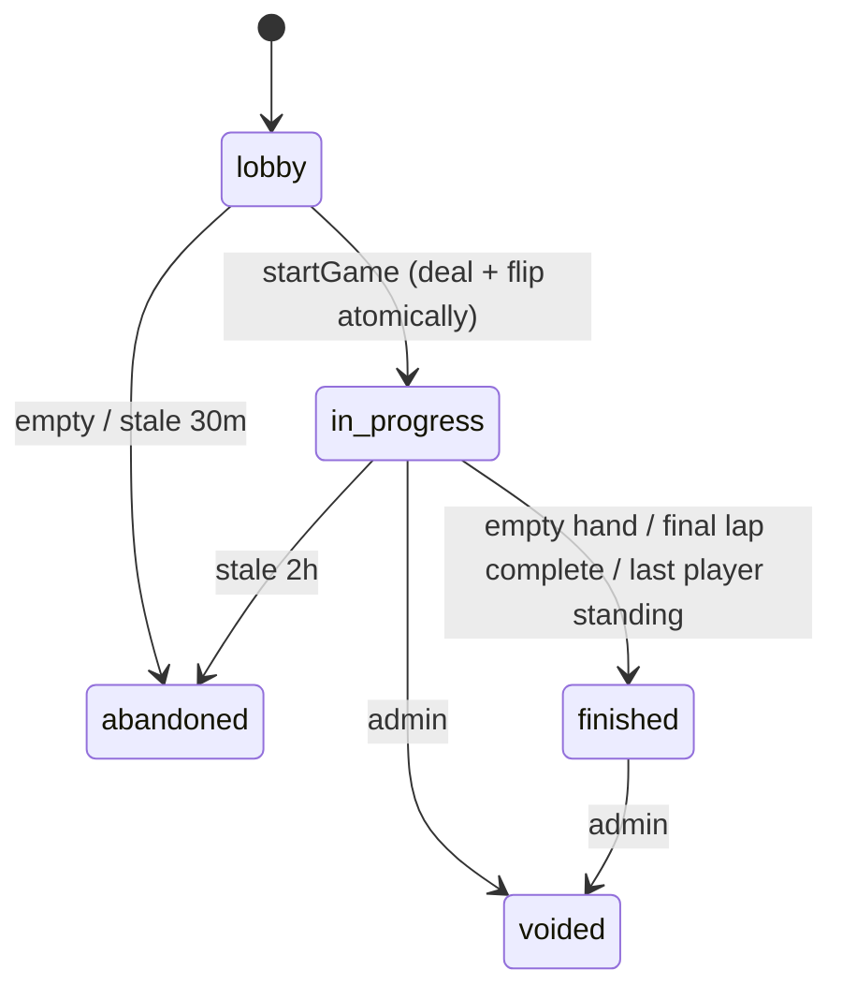
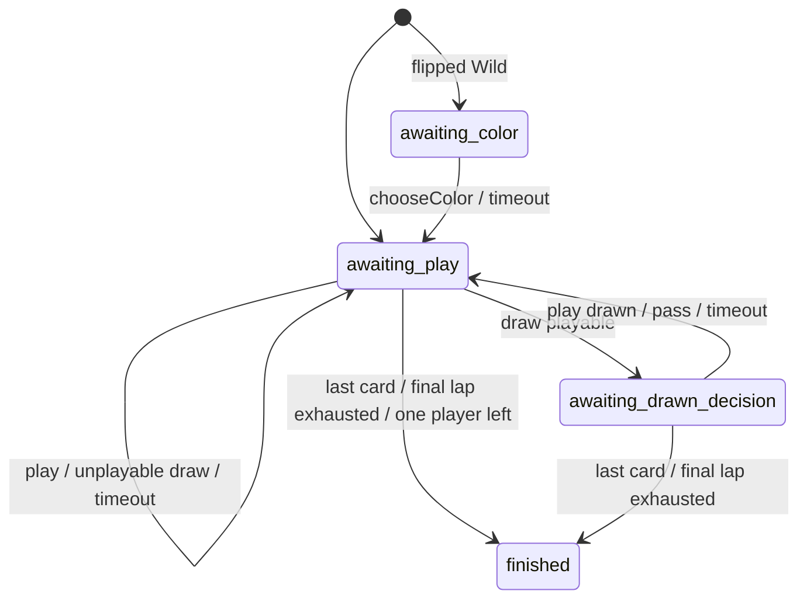

# Game Engine (`packages/engine`)

Related: [Architecture ADR-2, ADR-4, ADR-7](architecture.md#3-key-decisions) · [Data model](data-model.md) · [API](api.md) · [PRD §6](../PRD.md#6-game-rules-configuration)

The engine is a **pure, deterministic** TypeScript module. It has **no I/O, no clock, and no `Math.random()`**. Randomness comes from a seeded RNG stored in the state. Time is handled entirely by the caller: Cloud Functions decide when a timeout or the Final Lap happens and send the matching action ([ADR-4](architecture.md#adr-4-the-server-owns-the-clock-turn-timer-grace-final-lap-pause)).

It's used in three places:
- **Cloud Functions:** the authority for every real game.
- **The web client:** hints (which cards are playable and which buttons to enable).
- **The web client:** runs practice and tutorial games locally with bots ([ADR-7](architecture.md#adr-7-practice-and-tutorial-games-run-in-the-browser)).

## 1. Rules spec

### Deck: 108 cards
| Cards | Per color (red, yellow, green, blue) | Total |
|---|---|---|
| 0 | 1 | 4 |
| 1–9 | 2 each | 72 |
| Skip, Reverse, Draw Two | 2 each | 24 |
| Wild | — | 4 |
| Wild Draw Four | — | 4 |

**Card point values** (used to break placement ties): number cards are worth their face value, Skip/Reverse/Draw Two are 20, and Wild/Wild Draw Four are 50.

### Setup
1. Shuffle with the seeded RNG. Tests and the tutorial can supply `presetDeck` instead. Deal 7 cards to each seat, one at a time, starting from seat 0.
2. Pick the dealer at random (with the RNG). The first player is the one after the dealer, with `direction = 1`.
3. Flip the top card onto the discard pile:

| Flipped card | Effect |
|---|---|
| Number | Normal start. `currentColor` = the card's color. |
| Skip | The first player is skipped |
| Reverse | Direction becomes −1, and the **dealer** plays first. With 2 players, the first player is skipped, which has the same result. |
| Draw Two | The first player draws 2 and is skipped |
| Wild | The first player chooses the color (`phase = awaiting_color`), then plays |
| Wild Draw Four | Return it to the pile, reshuffle, and flip again |

### Turn
In `awaiting_play`, the current player must do exactly one of these:
- **Play** a card that matches `currentColor` or the top card's value, or any Wild.
  - **Wild Draw Four** is allowed only when the player holds no card of `currentColor`. This is enforced, so there's no challenge step.
  - A Wild or Wild Draw Four must include `chosenColor`.
- **Draw** 1 card. This is allowed even if the player holds a playable card. If the drawn card is playable, `phase = awaiting_drawn_decision`: the player can play **that card only**, or pass. Otherwise the turn passes.

### Card effects
| Card | Effect |
|---|---|
| Number | Next player |
| Skip | The next player loses their turn |
| Reverse | Direction flips. **With 2 players, it acts as a Skip.** |
| Draw Two | The next player draws 2 and loses their turn. **No stacking.** |
| Wild | `currentColor = chosenColor`, then next player |
| Wild Draw Four | `currentColor = chosenColor`. The next player draws 4 and loses their turn. |

"Next player" always skips forfeited seats.

### Turn counting
`turnCount` goes up by 1 each time the turn passes from one player to another. That includes timeouts and a player losing their turn to a Skip, Draw Two, or Wild Draw Four. It's used for the 12-turn minimum before a ranked game awards points ([tournament.md](tournament.md#which-results-count)).

### UNO call and catch
- Playing down to 1 card with `declareUno: true` counts as calling UNO. Otherwise `unoPending = uid`. That player can still send `callUno` to clear it.
- While `unoPending = X`, any **other** seated player can send `catchUno(X)`. X draws 2, and `unoPending` is cleared.
- The window closes when the next turn action happens (play, draw, pass, or timeout).

### Drawing from an empty pile
Reshuffle the discard pile (everything except the top card) with the RNG and emit `deck_reshuffled`. If both piles are empty, any draws that can't happen are skipped. A player who can't draw on their own turn passes.

### Timeouts (the `timeout` action, sent by the server after the deadline)
| Phase | Automatic action |
|---|---|
| `awaiting_play` | Draw 1, then pass. The drawn card is never played automatically. |
| `awaiting_drawn_decision` | Pass |
| `awaiting_color` | Choose the color the player holds most of, breaking ties red > yellow > green > blue |

A timeout adds 1 to `consecutiveTimeouts[uid]`, and any real action resets it. After `awayAfterTimeouts` (3) in a row, the player is marked `away[uid] = true` and stays Away until they take an action. The engine only reports Away status; **the caller** gives Away players the shorter 5-second turn.

### Final Lap (time cap)
When the caller detects `now >= finalLapAt`, it applies `{ type: 'startFinalLap' }` before the incoming action.

- `finalLap.active = true`. `finalLap.remaining` = the non-forfeited players in turn order, **starting with the current player**, so their current turn counts as their last one. Emits `final_lap`.
- Each time a turn moves on from a player, that player is removed from `remaining`. A player who **loses** their turn (Skip, Draw Two, or Wild Draw Four victim) is removed too: the lost turn *was* their last turn.
- A forfeit removes the player.
- The game ends as soon as someone empties their hand (they win, as normal), **or** when `remaining` becomes empty. In that case the game ends with `endedBy = 'final_lap'` and everyone is placed by the normal tiebreakers (§ Game end).
- UNO calls and catches still work during the Final Lap until the game ends.
- Applying `startFinalLap` again, or during `finished`, does nothing (idempotent).

### Leaving (forfeit)
Add the player to `forfeited`. Their hand is shuffled back into the draw pile. If it was their turn, play moves to the next player. If only 1 active player remains, the game ends with `endedBy = 'last_player_standing'`.

### Game end and placements
When a hand empties, the effect of the last card still happens (for example, the next player still draws after a final Draw Two or Wild Draw Four). Placements:
1. The winner: the player who emptied their hand. After a Final Lap or last-player-standing ending, there's no automatic winner, and the order below decides everyone.
2. Remaining active players by **fewest cards**, then **lowest hand point value**, then **seat distance from the current turn position** in the current direction (closer is better). After an empty hand, that distance is measured from the winner's seat.
3. Forfeited players, in reverse order of leaving (the first to leave finishes last).

### Per-game stats (for awards, Wrapped, and Passport context)
The engine keeps `stats[uid]` as the game is played. Functions copy these into `results.placements[].stats`.

## 2. Types

```ts
export type Color = 'red' | 'yellow' | 'green' | 'blue';
export type Value =
  | '0' | '1' | '2' | '3' | '4' | '5' | '6' | '7' | '8' | '9'
  | 'skip' | 'reverse' | 'draw2' | 'wild' | 'wild4';

export interface Card { id: string; color: Color | 'wild'; value: Value; }

export type Phase = 'awaiting_play' | 'awaiting_color' | 'awaiting_drawn_decision' | 'finished';
export type EndedBy = 'empty_hand' | 'final_lap' | 'last_player_standing';

export interface RulesConfig {
  handSize: number;            // 7
  awayAfterTimeouts: number;   // 3
  stacking: false;             // reserved for house rules
  sevenZero: false;
  jumpIn: false;
}

export interface PlayerGameStats {
  cardsPlayed: number;
  cardsPlayedByValue: Partial<Record<Value, number>>;
  wild4Played: number;
  draw2Played: number;
  cardsDrawn: number;
  unoCalls: number;
  catches: number;             // successful catches made
  timesCaught: number;
  timeouts: number;
  maxHandSize: number;         // peak cards held (Comeback Kid)
  wild4Victims: Record<string, number>;
}

export interface GameState {
  rules: RulesConfig;
  players: string[];                     // seat order
  hands: Record<string, Card[]>;
  drawPile: Card[];
  discardPile: Card[];
  currentColor: Color | null;
  direction: 1 | -1;
  turn: number;                          // index into players
  phase: Phase;
  drawnCardId: string | null;
  unoPending: string | null;
  consecutiveTimeouts: Record<string, number>;
  away: Record<string, boolean>;
  forfeited: string[];
  turnCount: number;
  finalLap: { active: boolean; remaining: string[] };
  stats: Record<string, PlayerGameStats>;
  rngState: number;
  placements: string[] | null;
  endedBy: EndedBy | null;
  version: number;
}

export type Action =
  | { type: 'play'; uid: string; cardId: string; chosenColor?: Color; declareUno?: boolean }
  | { type: 'draw'; uid: string }
  | { type: 'pass'; uid: string }
  | { type: 'chooseColor'; uid: string; color: Color }
  | { type: 'callUno'; uid: string }
  | { type: 'catchUno'; uid: string; targetUid: string }
  | { type: 'timeout' }
  | { type: 'startFinalLap' }
  | { type: 'forfeit'; uid: string };

export type EngineError =
  | 'NOT_YOUR_TURN' | 'WRONG_PHASE' | 'CARD_NOT_IN_HAND' | 'ILLEGAL_CARD'
  | 'ILLEGAL_WILD_DRAW_FOUR' | 'COLOR_REQUIRED' | 'MUST_PLAY_DRAWN_CARD_OR_PASS'
  | 'NO_UNO_PENDING' | 'CANNOT_CATCH_SELF' | 'NOT_A_PLAYER' | 'GAME_FINISHED';

export type EngineEvent = {
  type: 'game_started' | 'card_played' | 'cards_drawn' | 'turn_passed' | 'color_chosen'
      | 'uno_called' | 'uno_caught' | 'timeout' | 'player_forfeited' | 'deck_reshuffled'
      | 'final_lap' | 'game_finished';
  uid?: string; card?: Card; count?: number; targetUid?: string; color?: Color;
};
```

## 3. API

```ts
createDeck(): Card[];
createGame(players: string[], seed: number,
           opts?: { rules?: Partial<RulesConfig>; presetDeck?: Card[]; dealerIndex?: number }):
  { state: GameState; events: EngineEvent[] };

applyAction(state: GameState, action: Action):
  | { ok: true; state: GameState; events: EngineEvent[]; turnChanged: boolean }
  | { ok: false; error: EngineError; message: string };   // message = friendly hint text (O4)

legalActions(state: GameState, uid: string): {
  playableCardIds: string[]; canDraw: boolean; canPass: boolean; mustChooseColor: boolean;
  canCallUno: boolean; catchableUids: string[];
};

rankPlayers(state: GameState): Array<{ uid: string; place: number; cardsLeft: number;
                                       handValue: number; forfeited: boolean }>;

botAction(state: GameState, uid: string, rng: () => number,
          level?: 'tutorial' | 'normal'): Action | null;       // null = nothing to do

// Serialization for Functions
splitState(state): { publicDoc, hands: Record<string, Card[]>, privateDoc };
joinState(publicDoc, hands, privateDoc): GameState;
```

- `applyAction` never changes its input. It returns a new state with `version + 1`.
- `turnChanged` tells the caller to set a new `turnDeadline`.
- `message` gives the friendly explanation the UI shows for illegal moves, e.g. *"You can only play Wild Draw 4 when you have no red cards."*
- RNG: mulberry32. Shuffling: Fisher–Yates.

### Bot policy (`botAction`, practice and tutorial only)
Bots are simple but believable, and they never see other hands. They use only public information plus their own hand.

1. `awaiting_color`: choose the color the bot holds most of.
2. `awaiting_drawn_decision`: play the drawn card if it's legal (90% of the time), otherwise pass.
3. `awaiting_play`:
   - If the next player has 2 or fewer cards, prefer Draw Two, then Wild Draw Four (if legal), then Skip or Reverse.
   - Otherwise prefer number cards matching the current color (highest first, to shed points), then matching numbers or actions, then Wild, and Wild Draw Four last.
   - If nothing is playable, draw.
4. It declares UNO 85% of the time on `normal` and always on `tutorial`.
5. It catches a player it sees with `unoPending` after a random delay (the local runner manages the timing). `tutorial` bots never catch the player.

The **tutorial** uses `presetDeck` plus a fixed `dealerIndex`, so every lesson starts with the same hand and table.

## 4. State machines





`callUno`, `catchUno`, `forfeit`, and `startFinalLap` can happen in any phase except `finished`. `startFinalLap` sets a flag that runs alongside the phase rather than changing it.

## 5. Test plan (Vitest + fast-check, ≥ 90% line coverage in CI)

- **Deck:** 108 cards, unique IDs, correct composition.
- **Setup:** every flipped-card case, including Reverse with 2 players and re-flipping a Wild Draw Four. `presetDeck` and `dealerIndex` produce exactly the expected deal.
- **Legality:** color match, value match, wilds, Wild Draw Four allowed or refused, color required. The `message` text is present for every error.
- **Effects:** Skip, Reverse (2 players vs. 3–4), Draw Two, Wild Draw Four, wrapping around the table, skipping forfeited seats.
- **Draw flow:** playable vs. unplayable drawn card, can't play a different card, reshuffle, both piles empty.
- **UNO:** declaring with the play, calling late, catching in the window, catching after the window (refused), catching yourself (refused).
- **Timeouts:** every phase, Away after 3, reset on a real action, `stats.timeouts` counted.
- **Turn count:** increments on normal passes, timeouts, and lost turns. Doesn't increment for UNO calls, catches, or color choices.
- **Final Lap:**
  - starts from the current player
  - a skipped or Draw Two victim loses their last turn
  - a forfeit removes the player
  - someone emptying their hand during the lap wins
  - the game ends with `endedBy = 'final_lap'` when `remaining` is empty
  - applying it twice has no extra effect
- **End of game:** a final Draw Two still makes the next player draw, placement tiebreakers, forfeit order, last player standing.
- **Stats:** each counter matches a scripted game.
- **Bots:** `botAction` always returns a legal action (property test). Bot-only games of 1,000 random seeds always end (with or without the Final Lap) and never throw.
- **Invariants (property):** always 108 cards in total, no card in two places, `handCounts` matches the hands.
- **Determinism:** the same seed plus the same actions always gives the same final state.
